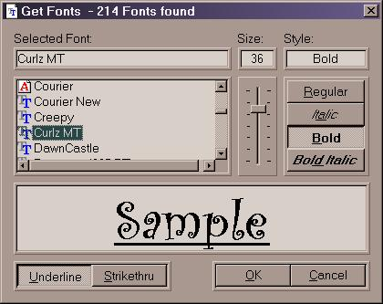



## CustFont

### Description

Here is a simple custom font dialog. Using the API

EnumFontFamily, it finds all TrueType and Fixed width

fonts. The font names are displayed, w/icon, in a listview.

A slider control allows continuous scrolling of font size.

A sample of the font at the selected size and style is displayed.

A DrawFameOn routine is included which is used to frame

all the controls (see screen shot).
 
### More Info
 
Written in VB6 and requires ListView, ImageList, and

Slider controls.

FontName

FontSize

FontStyle

Underline effect

StrikeThru effect

             |
---                |---
**Submitted On**   |2000-07-02 12:04:08
**By**             |[Rob Bogdanoff](https://github.com/Planet-Source-Code/PSCIndex/blob/master/ByAuthor/rob-bogdanoff.md)
**Level**          |Beginner
**User Rating**    |4.8 (29 globes from 6 users)
**Compatibility**  |VB 3\.0, VB 4\.0 \(16\-bit\), VB 4\.0 \(32\-bit\), VB 5\.0, VB 6\.0, VB Script, ASP \(Active Server Pages\) 
**Category**       |[Custom Controls/ Forms/  Menus](https://github.com/Planet-Source-Code/PSCIndex/blob/master/ByCategory/custom-controls-forms-menus__1-4.md)
**World**          |[Visual Basic](https://github.com/Planet-Source-Code/PSCIndex/blob/master/ByWorld/visual-basic.md)
**Archive File**   |[CODE\_UPLOAD7379722000\.zip](https://github.com/Planet-Source-Code/rob-bogdanoff-custfont__1-9458/archive/master.zip)

